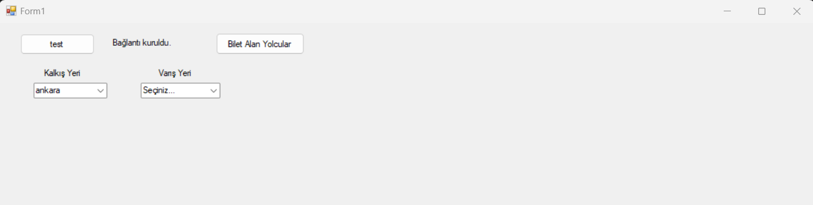
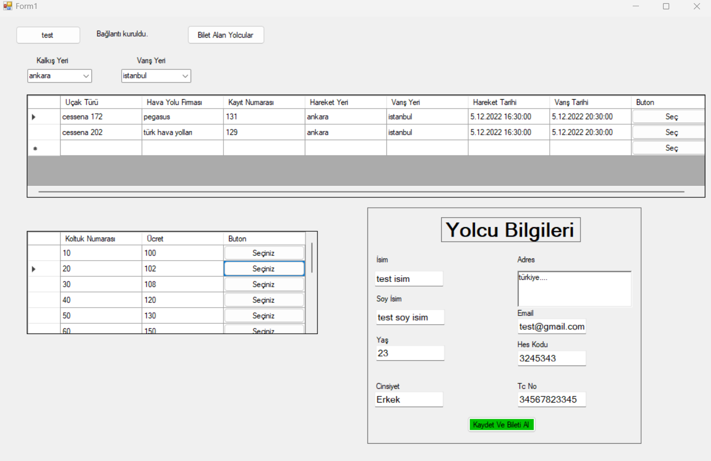
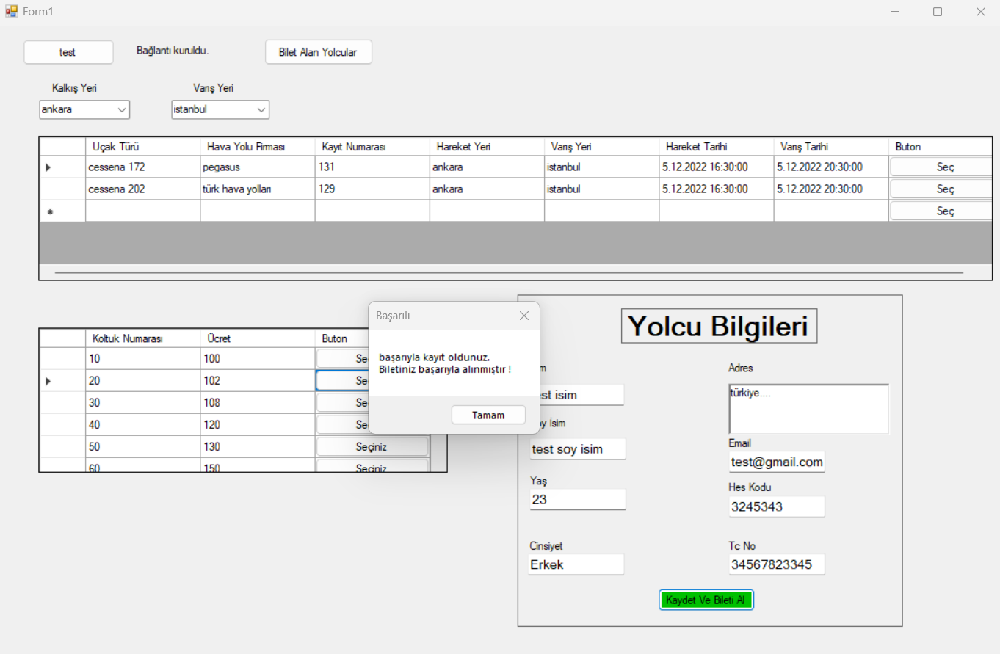
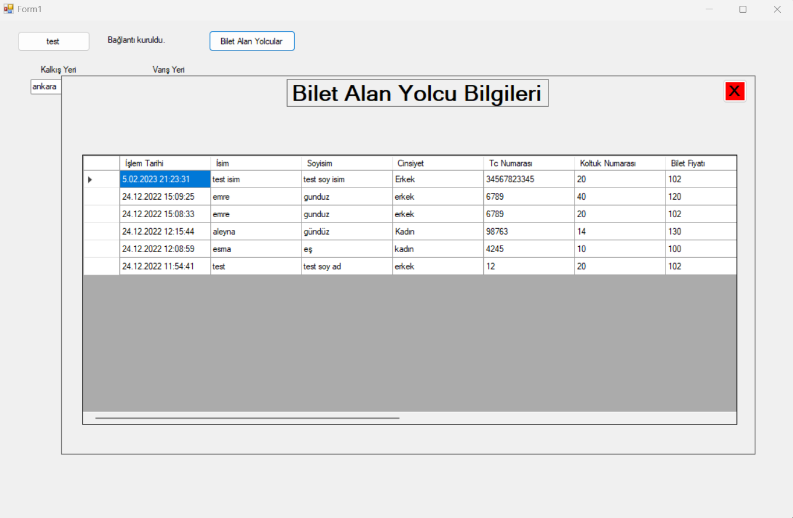

# Airline Windows Form App With Database

### Ahmet Bahadır Aksakal

#### 20360859079

****

- [EN : Description :book: :leftwards_arrow_with_hook:](#en)  
- [TR : Açıklama :book: :leftwards_arrow_with_hook:](#tr)

****

#### [EN]

##### Note: This project is an assignment that must be completed within 6 hours. Therefore, there are many deficiencies. Evaluate the project this way.

1. ### Technology and Languages Used in the Project:
    
     *C#
     * .Net
     *VisualStudio

2. ### Introduction:
    
     * This project is a passenger registration system
     * A windows form application has been designed to register a passenger with predefined data in the system and buy a ticket for him/her.
     * Data to be added to the system must be added to the database manually
     * There are many deficiencies in the project, I only had 6 hours to do the project, so something like this came out :)
       
3. ### Installation and Operation:
    
     * In your mysql database, run the SQL code in the "havayoludb.sql" file, make sure your database is created.
     Open the file with *.sln extension (it is recommended to use Visual Studio) and run it. Your application is ready.

4. ### Images from the Program:
    
    *   
    *   
    *   
    *   
      

****
****

#### [TR]

# Hava-Yolu-Kayit-Sistemi

### Ahmet Bahadır Aksakal

#### 20360859079

##### Not: Bu proje 6 saat içinde yetişmesi gereken bir ödevdir. Bu nedenle bir çok eksik bulunmaktadır. Projeyi bu şekilde değerlendiriniz.

1.  ### Projede Kullanılan Teknoloji Ve Diller:
    
    *   C#
    *   .Net
    *   Visual Studio
2.  ### Tanıtım:
    
    *   Bu proje bir yolcu kayıt sistemidir
    *   Sisteme önceden tanımlanmış veriler ile bir yolcuyu kayıt edip ona bilet aldığınız bir windows form uygulaması tasarlanmıştır
    *   Sisteme eklenecek veriler veritabanına manuel olarak eklenmelidir
    *   Projede bir çok eksik bulunmaktadır, projeyi yapmak için sadece 6 saatim vardı mecbur böyle bir şey ortaya çıktı :)
3.  ### Kurulum ve Çalıştırma:
    
    *   mysql veritabanınızda, "havayoludb.sql" dosyası içerisindeki sql kodunu çalıştırın, veritabanınızın oluştuğundan emin olun.
    *   .sln uzantılı dosyayı açın (Visual Studio kullanmanız önerilir) ve çalıştırın. Uygulanamanız hazır.
4.  ### Programdan Görseller:
    
    *   
    *   
    *   
    *   
